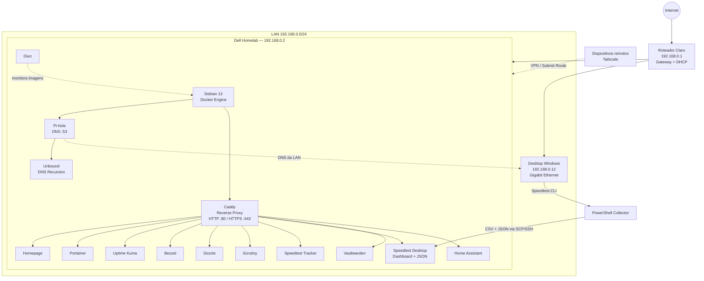
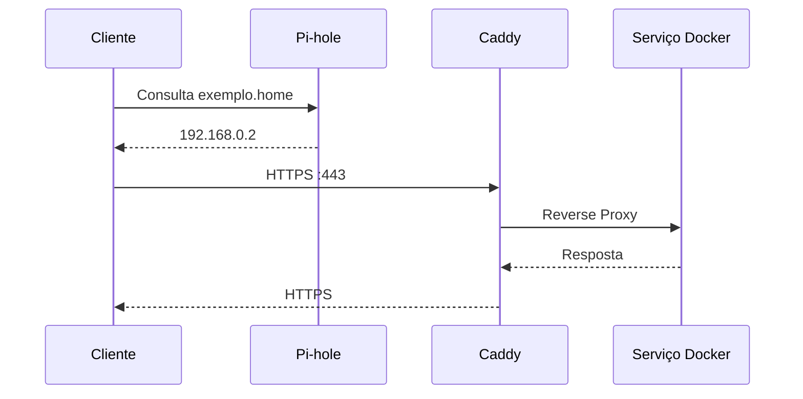
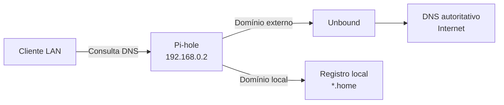
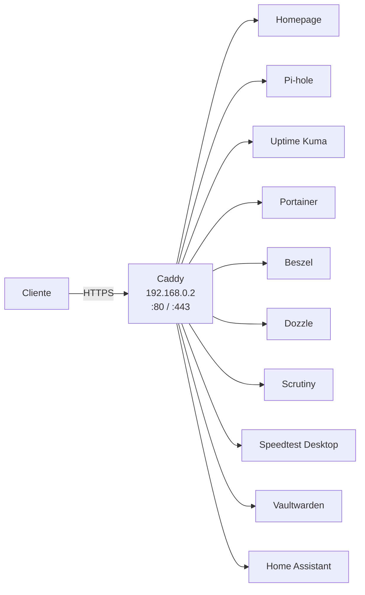
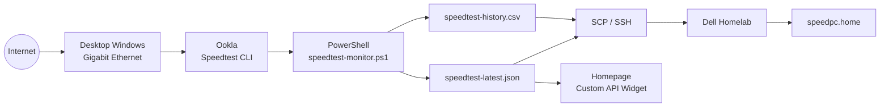
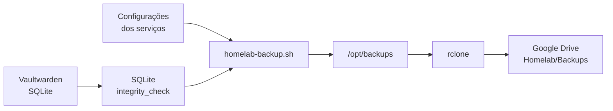
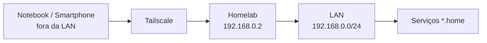

# Arquitetura do Homelab

Este documento representa a arquitetura lógica atual do ambiente.

## Visão geral



---

## Fluxo de acesso aos serviços

Um acesso típico a um serviço interno segue:



Exemplo:

```text
Cliente
   ↓
Pi-hole
   ↓
homelab.home → 192.168.0.2
   ↓
Caddy :443
   ↓
Homepage :3000
```

---

## Fluxo DNS



O roteador continua responsável pelo DHCP, enquanto o Pi-hole é responsável pelo DNS da rede.

---

## Reverse Proxy

O Caddy centraliza o acesso HTTP/HTTPS.



---

## Speedtest Desktop

O servidor Dell possui interface Fast Ethernet de 100 Mbps.

Por isso, uma segunda máquina realiza as medições de Internet.



O teste utiliza um servidor fixo para manter as medições comparáveis ao longo do tempo.

---

## Backup



A PKI privada do Caddy não é enviada para o armazenamento em nuvem.

---

## Acesso remoto



O Homelab anuncia a subnet `192.168.0.0/24`, permitindo acesso remoto aos serviços internos.

---

## Princípios da arquitetura

O ambiente busca aplicar práticas utilizadas em infraestrutura e DevOps:

- serviços declarados com Docker Compose;
- configuração versionada em Git;
- secrets separados do código;
- DNS centralizado;
- reverse proxy centralizado;
- HTTPS;
- observabilidade;
- health monitoring;
- backup automatizado;
- acesso remoto privado;
- documentação versionada;
- evolução para Infrastructure as Code.
