# Arquitetura do Homelab

Este documento representa a arquitetura lógica atual do ambiente, incluindo rede LAN, redes Docker, DNS, reverse proxy, firewall, acesso remoto, automação residencial e backup.

---

## Visão geral

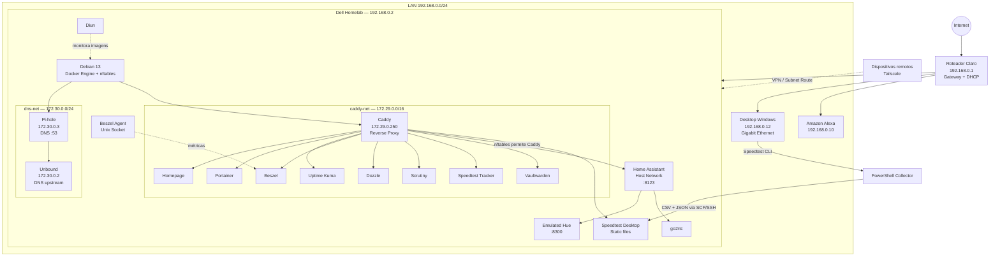

---

## Topologia de rede

### LAN

```text
192.168.0.0/24
```

Principais endereços:

```text
Gateway / DHCP       192.168.0.1
Homelab / DNS        192.168.0.2
Alexa                192.168.0.10
Desktop Windows      192.168.0.12
```

O roteador da operadora permanece responsável pelo DHCP.

O servidor utiliza endereço estático `192.168.0.2`.

---

## Redes Docker

A infraestrutura utiliza redes Docker distintas conforme a função.

### caddy-net

```text
172.29.0.0/16
```

Rede externa compartilhada entre o Caddy e os serviços publicados pelo reverse proxy.

O Caddy possui endereço fixo:

```text
172.29.0.250
```

O endereço fixo é necessário porque também participa das regras de firewall que controlam o acesso ao Home Assistant.

### dns-net

```text
172.30.0.0/24
```

Rede dedicada ao caminho DNS:

```text
Pi-hole     172.30.0.3
Unbound     172.30.0.2
```

O endereço fixo do Unbound evita dependência de IP Docker dinâmico no upstream do Pi-hole.

---

## Fluxo de acesso aos serviços

Um acesso típico a um serviço interno segue:

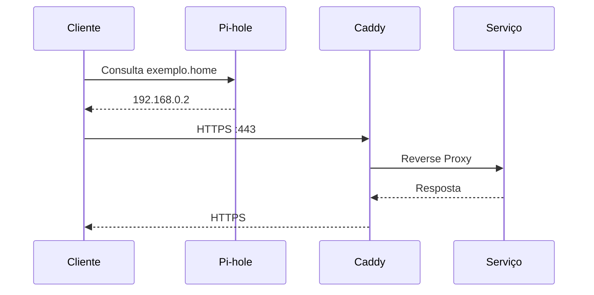

Exemplo:

```text
Cliente
   ↓
Pi-hole :53
   ↓
homelab.home → 192.168.0.2
   ↓
Caddy :443
   ↓
Homepage :3000
```

As portas internas dos serviços administrativos não precisam ser publicadas diretamente na LAN.

---

## Fluxo DNS

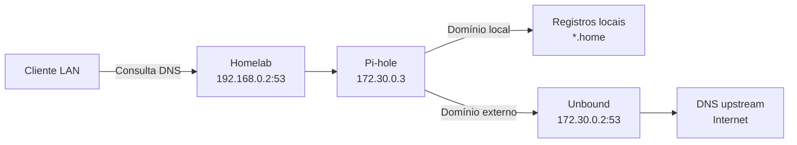

O Pi-hole é responsável por:

- DNS da LAN;
- resolução dos domínios `.home`;
- bloqueio;
- encaminhamento de consultas externas.

O Unbound é utilizado como upstream.

Para diagnóstico no próprio host:

```text
127.0.0.1:5335 → Unbound :53
```

Exemplo:

```bash
dig example.com @127.0.0.1 -p 5335
```

---

## Reverse Proxy

O Caddy centraliza o acesso HTTP/HTTPS.

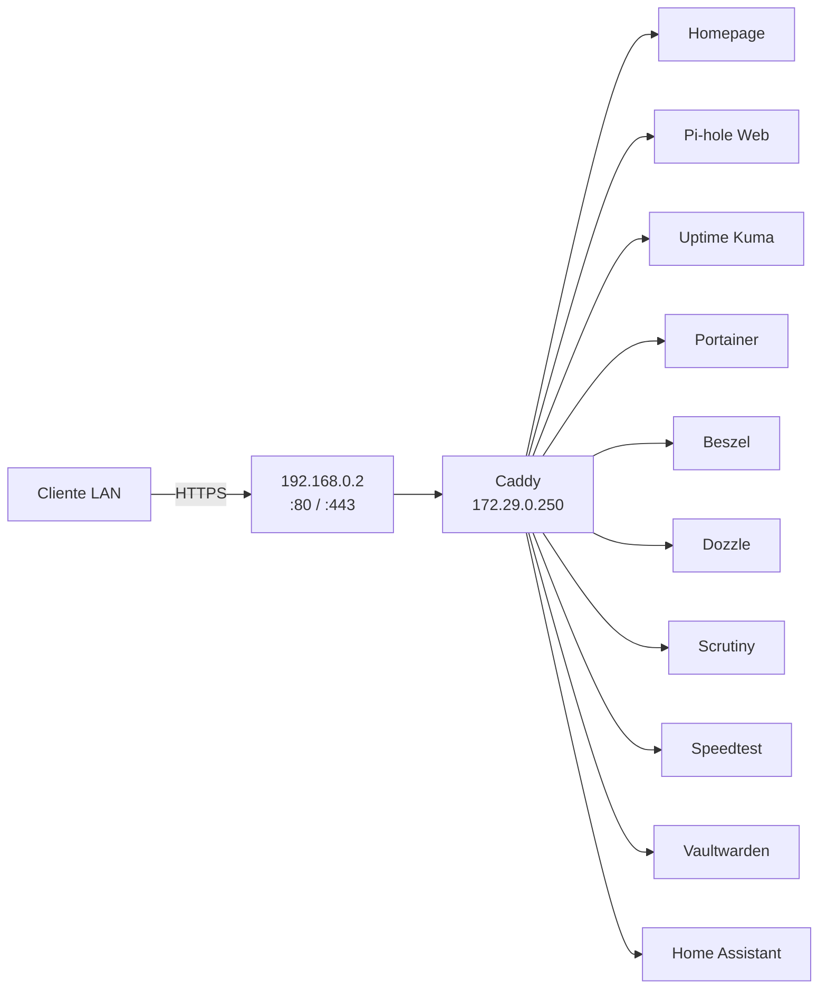

Os serviços são acessados através de nomes como:

```text
homelab.home
pihole.home
status.home
portainer.home
beszel.home
logs.home
scrutiny.home
speedtest.home
speedpc.home
vault.home
casa.home
```

---

## Firewall

O firewall do host utiliza `nftables`.

As regras específicas do laboratório ficam isoladas em:

```text
table inet homelab
```

Arquivo:

```text
/etc/nftables-homelab.conf
```

### Home Assistant

Fluxo permitido:

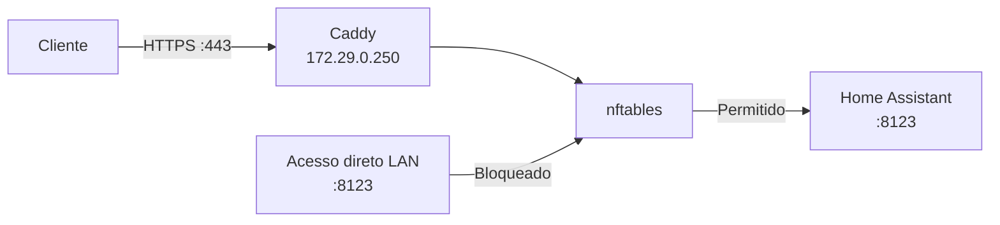

A porta `8123` aceita:

```text
localhost
172.29.0.250 (Caddy)
```

e bloqueia o restante.

### go2rtc

A porta `18555` não é disponibilizada diretamente para clientes da LAN.

### Docker

O nftables do homelab não executa:

```text
flush ruleset
```

globalmente.

Isso é necessário porque o Docker mantém suas próprias chains de NAT e firewall.

As regras próprias podem ser recarregadas independentemente:

```bash
sudo nft delete table inet homelab
sudo nft -f /etc/nftables-homelab.conf
```

Assim, as chains gerenciadas pelo Docker permanecem intactas.

---

## Alexa e Emulated Hue

O Home Assistant utiliza Emulated Hue para integração local com Alexa.

Fluxo simplificado:

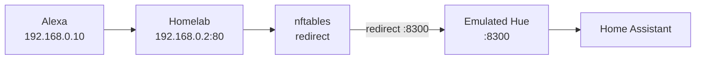

A porta `8300` é permitida somente para:

```text
192.168.0.10
localhost
```

O redirecionamento também é limitado ao IP da Alexa.

---

## Speedtest Desktop

O servidor Dell possui interface Fast Ethernet de 100 Mbps.

Por isso, uma segunda máquina realiza medições capazes de utilizar a conexão Gigabit.

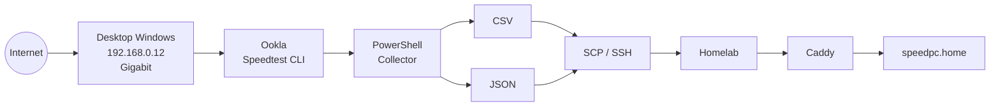

Não é utilizado SMB nesse fluxo.

---

## Backup

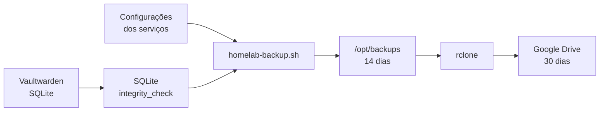

A PKI privada do Caddy não é enviada em claro para o armazenamento remoto.

---

## Acesso remoto

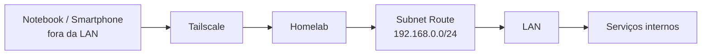

O homelab anuncia:

```text
192.168.0.0/24
```

como subnet route.

Isso permite acesso remoto sem expor interfaces administrativas diretamente à internet.

---

## Separação de exposição

A arquitetura diferencia três níveis de exposição.

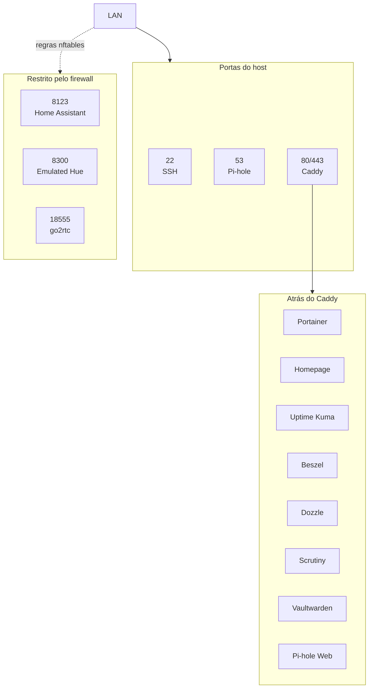

O objetivo é reduzir a superfície de ataque e centralizar o acesso web no reverse proxy.

---

## Resiliência e troubleshooting

Um incidente de DNS durante a evolução do laboratório demonstrou a interação entre firewall e Docker networking.

Fluxo investigado:

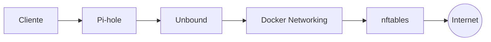

Foi identificado que uma recarga global do nftables utilizando `flush ruleset` removia chains NAT criadas pelo Docker.

Isso podia gerar um cenário em que containers existentes continuavam parcialmente funcionais, enquanto containers reiniciados não conseguiam recriar seus mapeamentos de portas.

Também foi eliminada a dependência de IP dinâmico entre Pi-hole e Unbound.

A correção incluiu:

- remoção do `flush ruleset` global;
- isolamento das regras em `inet homelab`;
- recarga independente das regras próprias;
- criação da `dns-net`;
- IP estático `172.30.0.2` para Unbound;
- IP estático `172.30.0.3` para Pi-hole;
- IP estático `172.29.0.250` para Caddy;
- validação das chains NAT do Docker;
- teste completo após reboot.

Após a reinicialização foram validados:

```text
Docker
Pi-hole
Unbound
DNS externo
Caddy
nftables
redes Docker
serviços persistentes
```

---

## Fluxo de mudança

As alterações seguem o fluxo:

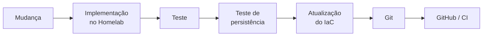

Esse processo permite que problemas de persistência, dependências de rede e diferenças entre configuração declarada e ambiente real sejam encontrados antes de considerar uma alteração concluída.

---

## Princípios da arquitetura

O ambiente busca aplicar práticas utilizadas em infraestrutura, operações e DevOps:

- serviços declarados com Docker Compose;
- configuração versionada em Git;
- secrets separados do código;
- DNS centralizado;
- redes Docker segmentadas por função;
- endereçamento estático quando necessário;
- reverse proxy centralizado;
- redução de portas diretamente expostas;
- HTTPS interno;
- firewall;
- observabilidade;
- health monitoring;
- backup automatizado;
- acesso remoto privado;
- documentação versionada;
- validação pós-reboot;
- troubleshooting baseado em camadas;
- Infrastructure as Code.
